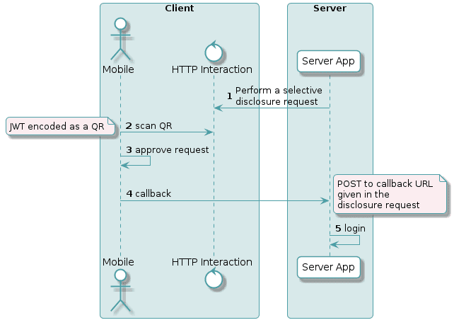

# Generic Server Side Login

A login to the App's backend involves first generating a challenge on the backend, and then sending that challenge to the Wallet where the user can confirm or deny the login (or could happen behind the scenes for a seamless experience if this is what you want). Then, the Wallet cryptographically signs the challenge with the user's keypair and sends back the signed challenge to the backend, where it's verified

